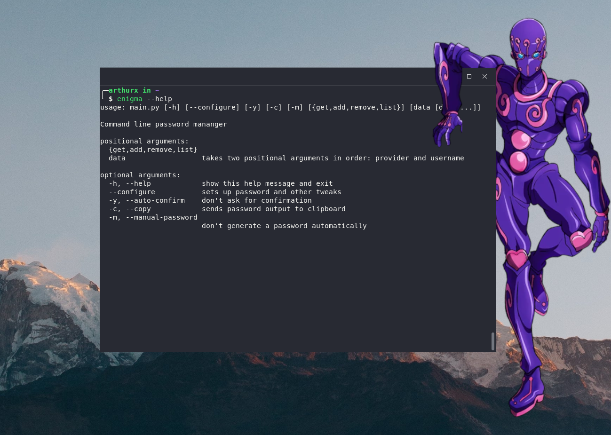

# 『ENIGMA』

Enigma is a password managing cli-tool that creates and cryptographs passwords and usernames.



## Installation

```sh
curl -s "https://raw.githubusercontent.com/xavier-arthur/enigma/master/install.sh" | sh
```
